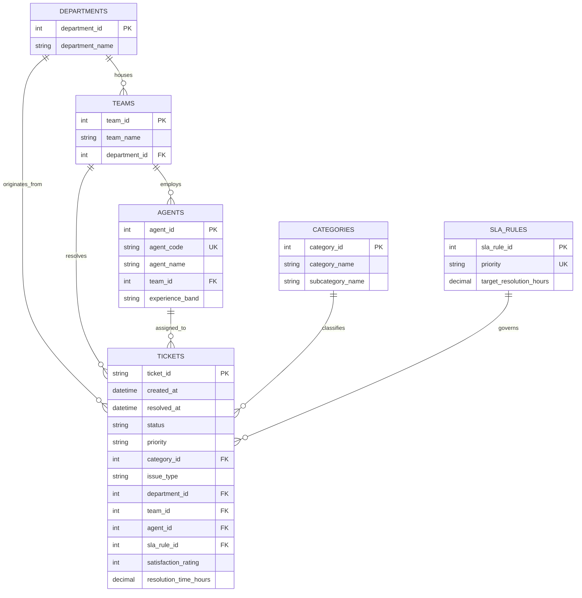

# Entity Relationship Diagram (ERD)

```mermaid
erDiagram
    DEPARTMENTS ||--o{ TEAMS : "houses"
    DEPARTMENTS ||--o{ TICKETS : "originates_from"
    TEAMS ||--o{ AGENTS : "employs"
    TEAMS ||--o{ TICKETS : "resolves"
    AGENTS ||--o{ TICKETS : "assigned_to"
    CATEGORIES ||--o{ TICKETS : "classifies"
    SLA_RULES ||--o{ TICKETS : "governs"

    DEPARTMENTS {
        int department_id PK
        string department_name
    }

    TEAMS {
        int team_id PK
        string team_name
        int department_id FK
    }

    AGENTS {
        int agent_id PK
        string agent_code UK
        string agent_name
        int team_id FK
        string experience_band
    }

    CATEGORIES {
        int category_id PK
        string category_name
        string subcategory_name
    }

    SLA_RULES {
        int sla_rule_id PK
        string priority UK
        decimal target_resolution_hours
    }

    TICKETS {
        string ticket_id PK
        datetime created_at
        datetime resolved_at
        string status
        string priority
        int category_id FK
        string issue_type
        int department_id FK
        int team_id FK
        int agent_id FK
        int sla_rule_id FK
        int satisfaction_rating
        decimal resolution_time_hours
    }
```
